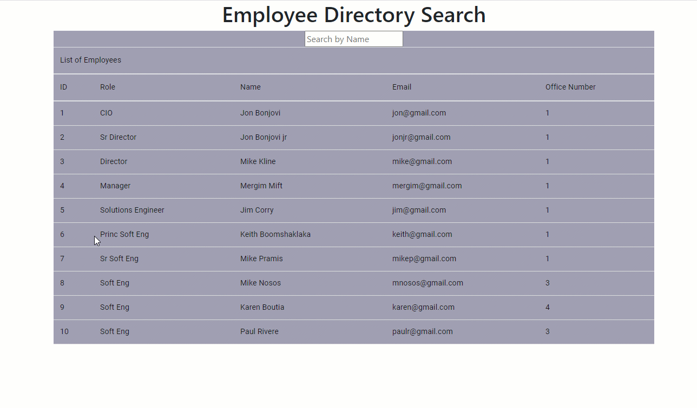

# React Employee Search

https://bowdwin.github.io/react-employee-tracker/

Track your Fitness!

# Table Of Contents:

- [Description](#Description)
- [Installation](#Installation)
- [Usage](#Usage)
- [Technologies](#Technologies)
- [Contributors](#Contributors)

## GIF shot Fitness Tracker!

# Description:

Uses a json file to pull in employee data, and you an sort it using react-table

# Installation:

The repository is set up , you will need to run npm init -y and npm install in order to install NPM packages .

Once the packages are installed you can start the server by typing node server file or by using nodemon.

The application can be run either on local port by accessing http://localhost:3000 which is connected to your local Mongo database or by running the app deployed in Heroku that is connected to a Mongo Database.

# Usage:

    1. Page loads, you can sort by clicking the header of a column
    2. You can search name by enter a name

# Technologies-

## Front-End Technologies:

    - HTML 5 is used to create a polished front-end.
    - CSS : For styling the HTML pages.
    - Javascript: This application conforms to the ECMA script specification.
    - react-table to help build the table and display the information
    - materialUI package to help the look of the table

# Contributors:

    - Keith Beaudoin
